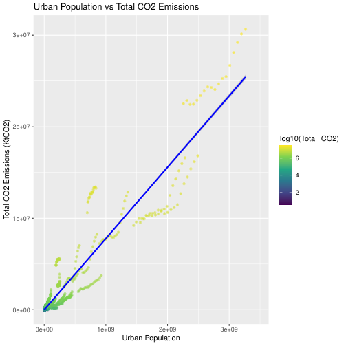
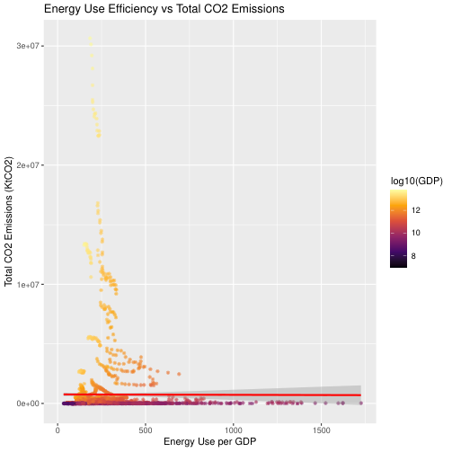
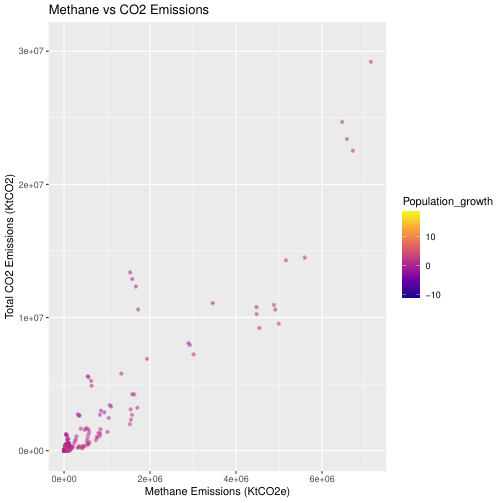
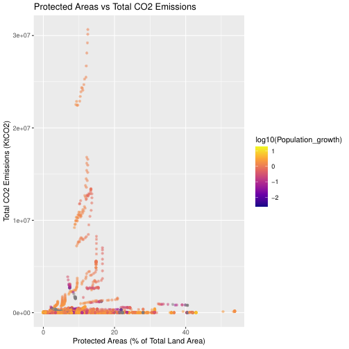
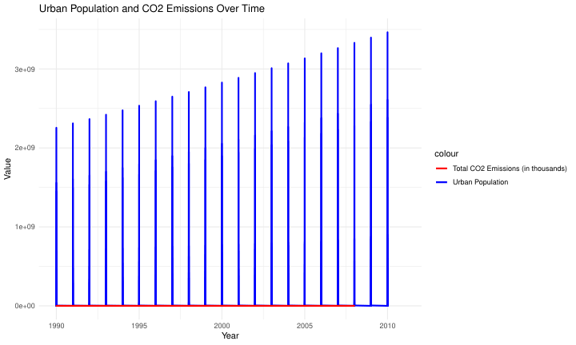

# Climate Changer Project

This project processes and analyzes climate data using R, leveraging Docker and Kubernetes for scalable deployment. Through detailed visualizations and analysis, it explores correlations between environmental factors and CO2 emissions.

---

## Overview

The Climate Changer project simplifies climate data analysis with the following components:

- **R Script**: Processes climate data and generates visualizations.
- **Docker**: Containerizes the application for portability.
- **Kubernetes**: Manages deployment and scaling.
- **Data Visualization**: Produces detailed insights into climate dynamics.

---

## Objectives

- Analyze the relationship between urbanization, energy usage, and CO2 emissions.
- Provide clear visual insights for policy-makers and researchers.
- Ensure scalability using modern containerization and orchestration technologies.

---

## Key Insights

### 1. **Urban Population vs CO2 Emissions**

- **Analysis**:
  - **Description**: The graph shows how urban population correlates with CO2 emissions.
  - **Insights**: 
    - Higher urban populations often lead to increased CO2 emissions.
    - Certain countries with rapid urbanization exhibit disproportionately high emissions.

---

### 2. **Energy Use Efficiency vs CO2 Emissions**

- **Analysis**:
  - **Description**: Relationship between energy use per GDP and total CO2 emissions.
  - **Insights**: 
    - Countries with low energy efficiency (higher energy use per GDP) tend to emit more CO2.
    - Economic reforms targeting energy efficiency could mitigate emissions.

---

### 3. **Methane Emissions vs CO2 Emissions**

- **Analysis**:
  - **Description**: Correlation between methane emissions and total CO2 emissions.
  - **Insights**:
    - Methane-heavy economies (agriculture, livestock) exhibit higher CO2 emissions.
    - Policies targeting methane reduction could have dual benefits.

---

### 4. **Protected Areas vs CO2 Emissions**

- **Analysis**:
  - **Description**: Examines how protected land areas influence CO2 emissions.
  - **Insights**:
    - Countries with larger protected areas show varied CO2 emission trends.
    - Suggests a need for integrated conservation and emission policies.

---

### 5. **Urban Population and CO2 Emissions Over Time**

- **Analysis**:
  - **Description**: Time series plot showing trends in urbanization and CO2 emissions.
  - **Insights**:
    - Both urban population and CO2 emissions have steadily increased since the 1990s.
    - Highlights the need for sustainable urban planning.

---

## Technologies Used

- **R Programming**: For data cleaning, processing, and visualization.
- **Docker**: Ensures application portability and consistency.
- **Kubernetes**: Provides scalable deployment and orchestration.
- **ggplot2**: Creates visually appealing and informative plots.
- **corrplot**: Generates correlation matrices for data exploration.

---

## Directory Structure

```plaintext
Climate-Changer/
├── output/                    # Folder containing generated visualizations
├── data/                      # Data folder (mapped to container's /app/data)
├── Dockerfile                 # Docker build file
├── deployment.yaml            # Kubernetes deployment configuration
├── compose.yaml               # Docker Compose file
├── data_analysis.R            # R script for data analysis
├── README.md                  # Project documentation
```

---

## Usage Instructions

### 1. **Build and Start Your Docker Image**

Build and start the Docker image to ensure the application works locally:

```bash
docker compose up --build
```

This will:
- Build the `climate-analyzer:latest` image.
- Start a container locally to confirm the application works as expected.

### 2. **Load the Image into Kubernetes**

After confirming the image works locally, load it into the Kubernetes cluster:

1. **Save the Image**:
   ```bash
   docker save climate-analyzer:latest -o climate-analyzer.tar
   ```

2. **Copy the Image to the Kubernetes Node**:
   ```bash
   docker cp climate-analyzer.tar climate-cluster-control-plane:/climate-analyzer.tar
   ```

3. **SSH into the Node**:
   ```bash
   docker exec -it climate-cluster-control-plane bash
   ```

4. **Load the Image into the Node's Container Runtime**:
   ```bash
   ctr --namespace k8s.io images import /climate-analyzer.tar
   ```

5. **Exit the Node**:
   ```bash
   exit
   ```

### 3. **Reapply the Deployment**

Reapply the deployment to ensure the latest image is used:

1. **Delete the Old Pods**:
   ```bash
   kubectl delete pod -l app=climate-analyzer
   ```

2. **Reapply the Deployment**:
   ```bash
   kubectl apply -f deployment.yaml
   ```

### 4. **Verify Pod Status**

Check the status of the pods to confirm the application is running:

```bash
kubectl get pods
```

### 5. **Access Processed Data**

The processed climate data is saved in the `data/` directory inside the container. To extract the data:

1. **Identify the Running Pod**:
   ```bash
   kubectl get pods
   ```

2. **Access the Pod**:
   ```bash
   kubectl exec -it <pod-name> -- bash
   ```

3. **Navigate to the Data Directory**:
   ```bash
   cd /app/data
   ```

4. **Copy Data to Your Local Machine**:
   ```bash
   kubectl cp <pod-name>:/app/data ./data
   ```

---

## Contributing

We welcome contributions to improve the project!  
- Open an issue for suggestions or bug reports.  
- Create a pull request for any improvements or features you'd like to propose.  

Feel free to reach out with any questions or feedback!